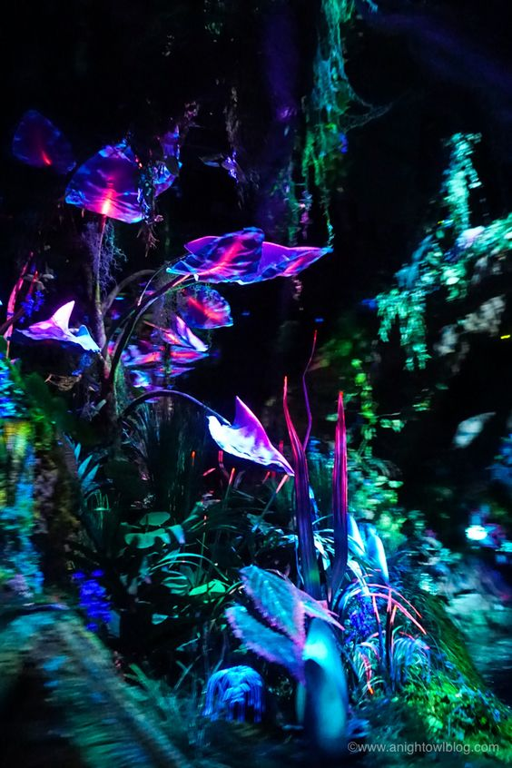
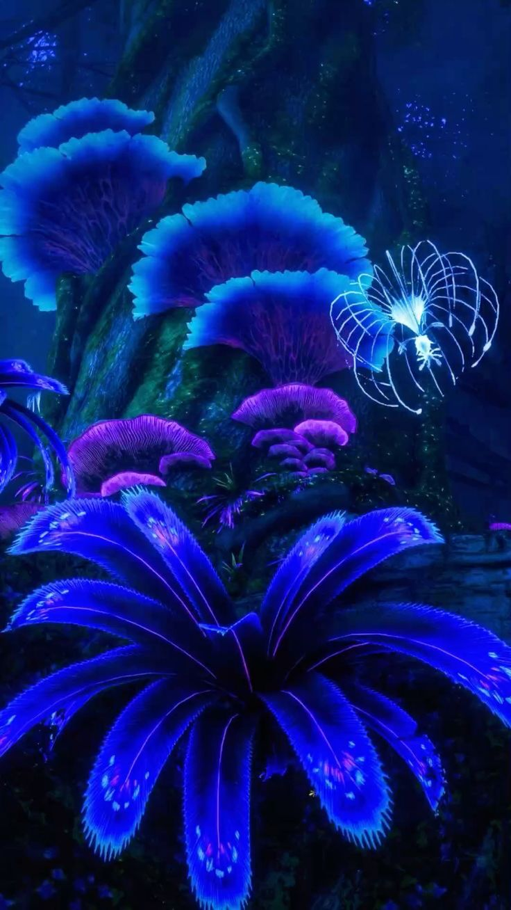

# yhan0177_quiz_8
My week8 quiz
**I looove resarching stuff for class**

# Part 1: Imaging Technique Inspiration
My inspiration based on the painting 'Ntange II (Grass)' by Emily Kame Kngwarreye. The planet Pandora from the Avatar film shows a fantastical scene illuminated by bioluminescent plants and creatures. They help to create a strong visual impact, evoking a sense of wonder and fantasy, similar to the captivating visuals in the painting. In terms of colour, the vibrant blues, purples and greens of the picture contrast strongly with the reds, pinks and yellows of 'Ntange II (Grass)'. The glowing effects of the organisms and plants on the image provide a way to make the scene more mysterious.

## Illustration of chosen example

## Reference:
[Link Text]（https://dylancolestudio.com/pandora-the-world-of-avatar）

[Link Text]（https://anightowltravels.com/10-reasons-to-visit-pandora-the-world-of-avatar/?utm_medium=social&utm_source=pinterest&utm_campaign=tailwind_tribes&utm_content=tribes&utm_term=288155472_7817082_244165）

# Part 2: Coding Technique Exploration
This code focuses on creating a dynamic collage of images by applying different images and colour overlays to create a Pandora-inspired visual effect similar to that seen in Avatar. This piece uses the keyTyped and mousePressed functions to allow the user to save the current image with a keyboard or mouse click, increasing the interactivity with the piece.
let colors = [...] Defines a set of colours that are randomly applied to the background and overlay image, this random and colourful application mimics the colourful organisms and environmental elements of the inspiration image.

## Image of example implecation

## Link of example code
[Link Text]https://openprocessing.org/sketch/2034149
